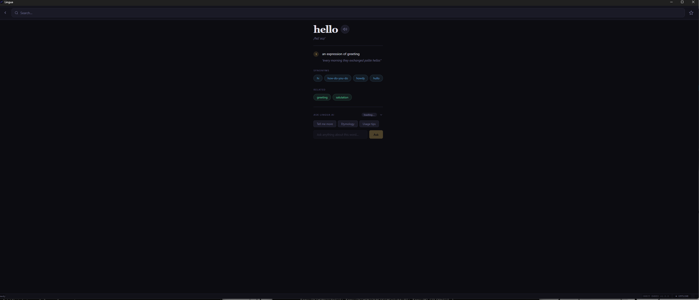

# Lingua

A fast, fully-offline **dictionary &amp; thesaurus** for the desktop — definitions,
synonyms, antonyms, pronunciation, and an on-device AI assistant, all running
locally with no network calls.

<p align="center"></p>

## Features

### Look things up
- **Word of the Day** on the home screen
- **Search by word _or_ by definition** — type what you mean and find the word
- **Word pages** with definitions grouped by part of speech, synonyms, antonyms,
  and related terms, powered by WordNet
- **Pronunciation** via the CMU Pronouncing Dictionary, with text-to-speech playback

### Keep track
- **Favorites** — star words to build your own list
- **Recently viewed** history on the home screen

### On-device AI
- An integrated **local LLM** (Qwen, served by `llama-server`) for richer
  explanations, usage examples, and Q&amp;A — runs entirely on your machine,
  no API keys, no internet

## Tech stack

- **UI:** PyQt6 + Qt WebEngine hosting an HTML/CSS/JS frontend, bridged to Python
- **Lexical data:** [WordNet](https://wordnet.princeton.edu/) via `nltk` and `wn`,
  CMU Pronouncing Dictionary
- **Speech:** `pyttsx3`
- **LLM:** [llama.cpp](https://github.com/ggml-org/llama.cpp) `llama-server` running a
  quantized GGUF model

## Requirements

- Windows
- **Python 3.11**
- For GPU inference: an NVIDIA GPU with a recent CUDA runtime (the app falls back to
  CPU if unavailable)
- Two large dependencies are **not** included in this repo and must be obtained
  separately (see below)

## Setup

These artifacts are intentionally excluded from the repository because of their size
and because they are freely re-downloadable:

1. **The language model.** Download a Qwen GGUF (Q4_K_M) and place it in the project
   root as `Qwen3.5-9B-Q4_K_M.gguf` (or update the filename in `main.py`).
2. **llama.cpp binaries.** Place a prebuilt llama.cpp (with CUDA DLLs) in a `llama.cpp/`
   folder containing `cuda/llama-server.exe` (CPU-only `llama-server.exe` in the folder
   root also works).

Then install the Python environment:

```cmd
install.cmd
```

This creates a virtual environment, installs `requirements.txt`, installs
`llama-cpp-python` (GPU build with CPU fallback), and downloads the offline word data
(WordNet + CMU dict) into `data/` via `setup.py`.

## Running

```cmd
run.cmd
```

(or `run.vbs` for a windowless launch, or `python main.py` inside the activated venv).
Both launchers resolve all paths relative to themselves, so the project works from any
clone location.

## Project layout

```
main.py            App entry point — wires the UI, bridge, and model paths
bridge.py          Python⇆JS bridge; manages WordNet/TTS and the llama-server subprocess
orbit_embed.py     Reusable PyQt6 WebEngine host window
app/               Frontend (index.html, assets/app.js, assets/style.css)
setup.py           One-time download of offline word data into data/
install.cmd        First-time environment setup
run.cmd / run.vbs  Launchers
requirements.txt   Python dependencies
```

## License

Licensed under the **GNU General Public License v3.0** — see [LICENSE](LICENSE).

GPLv3 is required because Lingua builds on **PyQt6**, which is distributed under
the GPL. Bundled/optional components keep their own permissive licenses, all
compatible with GPLv3: [llama.cpp](https://github.com/ggml-org/llama.cpp) (MIT),
NLTK (Apache-2.0), [WordNet](https://wordnet.princeton.edu/license) (BSD-style),
and `wn` (MIT). The Qwen model you supply is covered by its own license.
